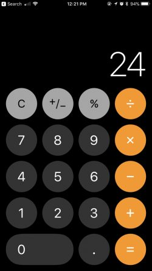
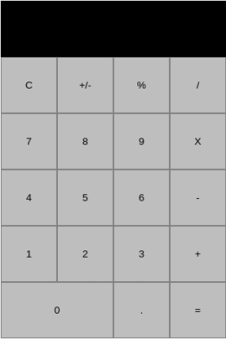

# Calculadora Javascript - Layout

## Que vamos a hacer

El diseño que vamos a seguir es el de la calculadora de iOS.

## Como pensamos el layout

El layout es como se ubican los elementos en una pagina, o en un pedazo de la pagina.   
En este caso tenemos dos temas por resolver: centrar la calculadora, ubicar los elementos (botones, display) de la calculadora en donde corresponde.

Este es el layout basico que queremos lograr en este paso.

