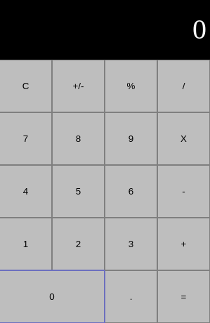

# Calculadora Javascript - Estilos

## Del layout al diseño esperado

Ahora que ya tenemos el layout que deseamos. En el Paso 1 deberiamos tener algo asi.

Para poder lograr que se vea como en la Calculadora iOS tenemos que aplicarle estilo a los botones cambiando colores, bordes, fuentes, etc.

